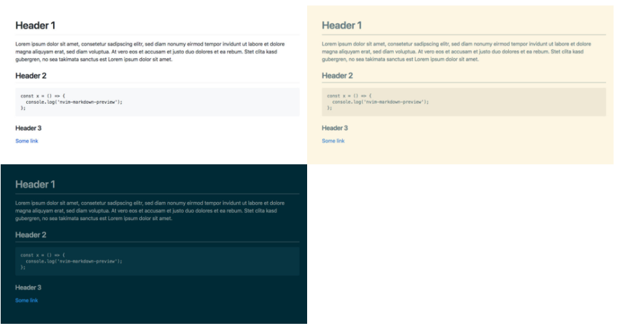

# nvim-markdown-preview

Markdown preview in the browser using [pandoc](https://pandoc.org/) and [live-server](https://github.com/tapio/live-server) through Neovim's [job-control API](https://neovim.io/doc/user/job_control.html).

## Usage

Open a markdown file in vim and run `:MarkdownPreview`. The preview opens in a new browser tab which will be reloaded whenever you `:write` the buffer. If you accidentally close your browser tab or want to change the theme just run the command again. The file needs to be written to disk before you can start the preview.

## Features

* Asynchronous
* Produces "standalone" html files (injected css)
* Custom themes (`github`, `solarized-dark`, `solarized-light`)
* Auto-reloads browser tab on save
* Serves assets from the current working directory (embed pictures in your markdown etc.)
* Uses [pandoc markdown](https://pandoc.org/MANUAL.html#pandocs-markdown)
* [KaTeX](https://katex.org/) for formatting LaTeX math
* Syntax highlighting from the [Kate Editor themes](https://github.com/KDE/syntax-highlighting#color-theme-files)

## Requirements

* `pandoc`
* `live-server` (Node.js)

`pandoc` and `live-server` executables should be installed and accessible in your `$PATH`.
### Pandoc

Pandoc should be available in most linux distributions and on macOS via brew and Windows via chocolatey.

On [macOS](https://pandoc.org/installing.html#macos) it could look something like:

```
brew install pandoc
```

For [Linux](https://pandoc.org/installing.html#linux):

Ubuntu
```
sudo apt install pandoc
```

Fedora
```
sudo dnf install pandoc
```

For [Windows](https://pandoc.org/installing.html#windows):

Either down the executable or via Chocolatey
```
choco install pandoc
```

For other systems please see the links in the description on how to install.

### live-server

Assuming you have [Node.js](https://nodejs.org/en/download/) installed:
```
npm install -g live-server
```

or if you prefer yarn
```
yarn global add live-server
```

## Installation

If you are using [vim-plug](https://github.com/junegunn/vim-plug)

`Plug 'davidgranstrom/nvim-markdown-preview'`

source the file (`:source %`) (or restart vim) and then run `:PlugInstall`

## Documentation

Take a look at `:help nvim-markdown-preview` for documentation and examples.

## Screenshots



## Q & A

**Q:** Why doesn't the preview update in real-time while I type in vim?

**A:** This plugin simply doesn't work like that. It is aimed to be "lightweigth" (if you already are a node.js/pandoc user that is).
It simply provides some live update capabilities around what is essentially `:w !pandoc % -o /tmp/file.html`

**Q:** I want the preview tab to open automatically without typing `:MarkdownPreview`

**A:** Sure, use an `autocmd` like:
```
autocmd FileType markdown MarkdownPreview
```

Or the `<Plug>` mapping to bind it to the key of your choice
```
nmap <cr> <plug>(nvim-markdown-preview)
```

## TODO

The markdown file must be written to disk first. It should be possible to use Pandoc `stdin` and pipe the buffer content using `jobsend()` instead.

## License

GPL v3

```
nvim-markdown-preview
Copyright (C) 2018 David Granström

This program is free software: you can redistribute it and/or modify
it under the terms of the GNU General Public License as published by
the Free Software Foundation, either version 3 of the License, or
(at your option) any later version.

This program is distributed in the hope that it will be useful,
but WITHOUT ANY WARRANTY; without even the implied warranty of
MERCHANTABILITY or FITNESS FOR A PARTICULAR PURPOSE.  See the
GNU General Public License for more details.

You should have received a copy of the GNU General Public License
along with this program.  If not, see <https://www.gnu.org/licenses/>.
```
